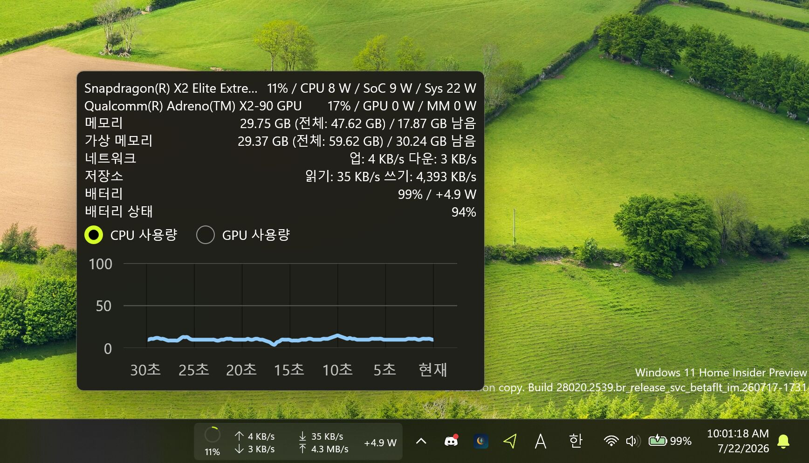

# PC의 맥박을 작업표시줄에.

🌐 [English](README.md) | 한국어

PinStats는 Windows 10/11에서 실시간 PC 자원 사용량을 보여주는 가벼운 앱입니다. CPU, GPU, 메모리, 네트워크, 스토리지, 배터리 정보를 보여주며, 트레이 아이콘에 퍼센트를 표시해주는 앱은 많지만 Windows 11 작업표시줄에 위젯을 직접 고정할 수 있는 앱은 거의 없습니다. PinStats는 그 위젯을 중심으로, 실시간 숫자 트레이 아이콘과 작은 팝업, 원하는 모니터에 띄우는 풀스크린 하드웨어 모니터 대시보드까지 함께 제공합니다.

Windows 11 작업표시줄 위젯은 사용량 링과 속도 수치를 항상 보이게 해줍니다. 트레이 아이콘은 0.25초마다 현재 CPU 또는 GPU 사용량 숫자를 표시합니다. 좌클릭으로 작은 팝업을, 우클릭으로 선택한 모니터에 풀스크린 대시보드를 띄울 수 있습니다.

## 스크린샷

## 주요 기능

- **Windows 11 작업표시줄 위젯:** 사용량 링과 속도 수치를 Windows 11 작업표시줄에 직접 고정합니다. 거의 다른 시스템 모니터에서는 찾아볼 수 없는 기능이며, 8개 항목을 각각 켜고 끌 수 있습니다.
- **실시간 트레이 아이콘:** 현재 CPU 또는 GPU 사용량 숫자가 0.25초마다 트레이 아이콘 위에 바로 그려집니다. 무언가를 열지 않아도 시스템 상태를 한눈에 볼 수 있습니다.
- **네 가지 표시 형태:** 시스템 트레이 아이콘, 작은 팝업, 풀스크린 하드웨어 모니터 대시보드, Windows 11 작업표시줄 위젯 중에서 상황에 맞게 고를 수 있습니다.
- **풍부한 센서 정보:** CPU, GPU, 메모리(물리 + 가상), 네트워크, 스토리지, 배터리(수명 상태 포함)의 사용량·온도·전력 소비와 마더보드 이름을 보여줍니다.
- **다중 GPU·다중 모니터:** GPU가 여러 개일 때 모니터할 GPU를 고를 수 있고, 연결된 모니터 중 어디에든 풀스크린 대시보드를 띄울 수 있습니다.
- **30초 실시간 차트:** 팝업과 대시보드에서 최근 30초 동안의 CPU/GPU 사용량 변화를 라인 차트로 볼 수 있습니다.
- **자동 업데이트 확인:** 새 버전이 나오면 토스트 알림으로 알려줍니다.
- **시작 프로그램 지원:** 로그인 시 자동으로 실행되도록 설정할 수 있습니다.
- **다국어 지원:** 영어, 한국어, 일본어, 중국어 간체, 중국어 번체.

## 왜 PinStats인가요?

트레이 아이콘에 퍼센트를 표시해주는 앱은 많습니다. PinStats는 그 한계를 넘어, Windows 11 작업표시줄에 위젯을 직접 고정합니다. 거의 다른 시스템 모니터에서는 찾아볼 수 없는 기능입니다. 위젯은 작업하는 동안 계속 보이므로 CPU, GPU, 메모리, 네트워크, 스토리지 상태를 무언가를 열지 않아도 한눈에 볼 수 있습니다. 작은 팝업과 원하는 모니터에 띄우는 테두리 없는 풀스크린 대시보드가 나머지를 채워줍니다.

## 표시 형태

| 형태 | 위치 | 보여주는 것 |
|---|---|---|
| **트레이 아이콘** | 시스템 트레이 | 실시간 CPU 또는 GPU 사용량 숫자가 아이콘 위에 그려집니다. 흰색/검정색 변형을 메뉴에서 전환할 수 있습니다. |
| **팝업** | 트레이 아이콘 또는 작업표시줄 위젯 좌클릭 | CPU, GPU, 메모리, 가상 메모리, 네트워크, 스토리지, 배터리, 배터리 수명 상태와 30초 CPU/GPU 라인 차트. 포커스를 잃으면 자동으로 닫힙니다. |
| **하드웨어 모니터** | 트레이 아이콘 우클릭 → 하드웨어 모니터 표시 → 모니터 | 선택한 모니터에 테두리 없는 풀스크린 대시보드를 띄웁니다. 큰 CPU/GPU 라인 차트와 메모리/배터리 바 게이지가 있습니다. PC 본체 안에 작은 디스플레이를 따로 둔 사용자에게 특히 유용합니다. |
| **작업표시줄 위젯** | Windows 11 작업표시줄 | ProgressRing 사용량 표시와 속도 수치가 담긴 작은 띠. 클릭하면 팝업이 열립니다. |

## 모니터링 대상

- **CPU** — 사용률, 온도, 패키지 전력, 이름.
- **GPU** — 사용률, 온도, 전력, 이름. GPU가 여러 개일 때는 인덱스로 선택할 수 있습니다.
- **메모리** — 물리 메모리와 가상 메모리의 총량, 사용량, 가용량.
- **네트워크** — 업로드와 다운로드 속도.
- **스토리지** — 초당 읽기/쓰기 속도.
- **배터리** — 잔량(%), 충전·방전 전력(W), 남은 시간 추정치, 설계 용량 대비 수명 상태(%). 배터리가 없는 기기에서는 배터리 항목이 자동으로 숨겨집니다.
- **마더보드** — 모델명.
- **ARM64 SoC 전력** — ARM64 기기에서 CPU 패키지, GPU, SoC, 시스템 전력을 추가로 보여줍니다.

## 요구 사항

- **운영체제:** Windows 10 버전 1809(빌드 17763) 이상 또는 Windows 11. 작업표시줄 위젯은 Windows 11이 필요합니다.
- **아키텍처:** x64 또는 ARM64.
- **권한:** 관리자 권한. 하드웨어 센서에 접근하기 위해 관리자 권한으로 실행됩니다.

## 라이선스

[MIT 라이선스](LICENSE)로 배포됩니다. [LibreHardwareMonitor](https://github.com/LibreHardwareMonitor/LibreHardwareMonitor)의 포크가 내장되어 있으며, 해당 라이브러리는 Mozilla Public License 2.0로 배포됩니다.

## 제작자

[이호원 (airtaxi)](https://github.com/airtaxi)이 만들었습니다.

## 기여자

