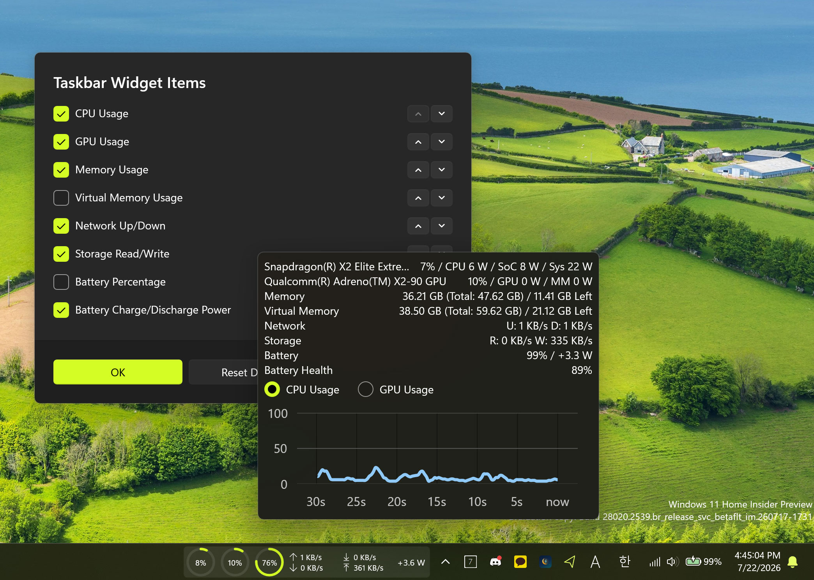

# Your PC's pulse, pinned to the taskbar.

🌐 English | [한국어](README.ko.md)

PinStats is a lightweight Windows 10/11 app that shows real-time PC resource usage: CPU, GPU, memory, network, storage, and battery. Plenty of apps paint a percentage onto a tray icon, but PinStats is one of the only apps that can pin a live usage widget directly into the Windows 11 taskbar. Alongside that widget it also offers a live-number tray icon, a compact popup, and a borderless fullscreen hardware-monitor dashboard for any monitor.

The Windows 11 taskbar widget keeps a compact strip of usage rings and speed readouts always visible. The tray icon renders the current CPU or GPU usage number every 0.25 seconds. A left-click opens a compact popup, a right-click sends a fullscreen dashboard to the monitor of your choice.

## Screenshot

## Highlights

- **Windows 11 taskbar widget.** A compact strip of usage rings and speed readouts pinned straight into the Windows 11 taskbar, a capability almost no other system monitor offers. Toggle each of the eight items on or off individually.
- **Live tray icon.** The current CPU or GPU usage number is drawn directly onto the system-tray icon every 0.25 seconds, so your system's state is visible without opening anything.
- **Four display surfaces.** System-tray icon, quick popup, fullscreen hardware-monitor dashboard, and a Windows 11 taskbar widget.
- **Comprehensive telemetry.** CPU, GPU, memory (physical + virtual), network, storage, and battery (with health). Reports usage, temperatures, and power draw, plus the motherboard name.
- **Multi-GPU and multi-monitor.** Choose which GPU to monitor when more than one is present, and open the fullscreen dashboard on any connected monitor.
- **30-second live charts.** The popup and the dashboard show a rolling 30-second CPU/GPU line chart.
- **Automatic update checks.** Shows a toast notification when a new version is available.
- **System startup.** Optional auto-start at login.
- **Localized.** English, Korean, Japanese, Simplified Chinese, and Traditional Chinese.

## Why PinStats?

Plenty of apps can paint a percentage onto a tray icon. PinStats goes further by pinning a live usage widget directly into the Windows 11 taskbar, something almost no other system monitor does. The widget stays visible while you work, so you see CPU, GPU, memory, network, and storage at a glance without opening anything. A compact popup and a borderless fullscreen dashboard for any monitor are also available.

## Display Surfaces

| Surface | Where | What it shows |
|---|---|---|
| **Tray icon** | System tray | Live CPU or GPU usage number rendered onto the icon. White or black variant, switchable from the menu. |
| **Popup** | Left-click the tray icon or the taskbar widget | Compact summary: CPU, GPU, memory, virtual memory, network, storage, battery, battery health, plus a 30-second CPU/GPU line chart. Auto-closes on focus loss. |
| **Hardware Monitor** | Right-click the tray icon → Show Hardware Monitor → monitor | Borderless fullscreen dashboard on the chosen monitor with large CPU/GPU line charts and memory/battery bar gauges. Handy if you keep a small secondary display inside your PC case. |
| **Taskbar widget** | Windows 11 taskbar | Compact strip of ProgressRing usage indicators and speed readouts. Click to open the popup. |

## Monitoring Targets

- **CPU:** Usage percentage, temperature, package power, and name.
- **GPU:** Usage percentage, temperature, power, and name. Selectable index when multiple GPUs are present.
- **Memory:** Physical and virtual memory, total, used, and available.
- **Network:** Total upload and download speed.
- **Storage:** Read and write rate per second.
- **Battery:** Percentage, charge or discharge power in watts, estimated time remaining, and health as a ratio of fully-charged to designed capacity. Battery items auto-hide on devices without a battery.
- **Motherboard:** Model name.
- **ARM64 SoC power:** On ARM64 devices, additional CPU package, GPU, SoC, and system power readings.

## Requirements

- **OS:** Windows 10 version 1809 (build 17763) or later, or Windows 11. The taskbar widget requires Windows 11.
- **Architecture:** x64 or ARM64.
- **Privileges:** Administrator. Runs elevated so it can read hardware sensors.

## License

PinStats is licensed under the [MIT License](LICENSE). It bundles a vendored fork of [LibreHardwareMonitor](https://github.com/LibreHardwareMonitor/LibreHardwareMonitor), which is licensed under the Mozilla Public License 2.0.

## Author

Created by [Howon Lee (airtaxi)](https://github.com/airtaxi).

## Contributors

